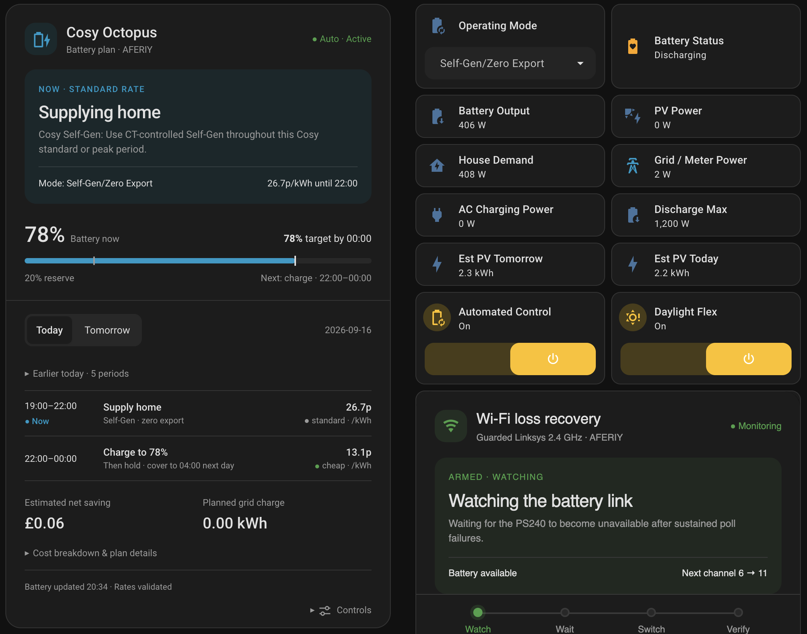
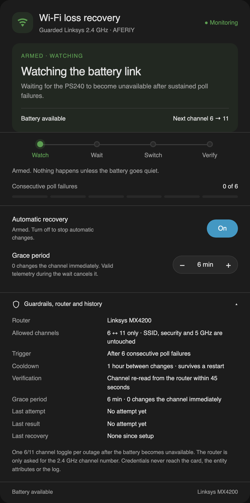

# Dashboard Card



*A live dashboard: the Cosy Octopus plan card, live battery telemetry, and the
Wi-Fi loss recovery card. See [Cosy planner](COSY_PLANNER.md) for the plan card
itself.*

The integration includes a reusable Lovelace card for the smart overnight plan.
It shows target SOC, battery capacity, day balance, Pre-Sunrise Need,
Post-Sunset Need, useful solar, confidence, and SMART History completeness.

## Add The Card Resource

After installing or updating the integration and restarting Home Assistant, add this dashboard resource:

```text
/aecc_battery_static/aferiy-overnight-plan-card.js?v=1.8.34
```

Set the resource type to:

```text
JavaScript module
```

Once the resource is loaded, open a dashboard, choose **Add card**, switch to **By card**, and search for:

```text
AFERIY Overnight Plan
```

## Manual YAML

You can also add it manually:

```yaml
type: custom:aferiy-overnight-plan-card
```

Optional entity overrides are available if your entities have unusual names:

```yaml
type: custom:aferiy-overnight-plan-card
recommended_entity: sensor.aferiy_ps240_local_recommended_overnight_soc
overnight_status_entity: sensor.aferiy_ps240_local_automatic_overnight_charging_status
solar_availability_entity: select.aferiy_ps240_local_solar_availability
smart_history_entity: sensor.aferiy_ps240_local_smart_history
```

The card reads the calculation from the Recommended Overnight SOC sensor. It does not make charging decisions itself.

## Wi-Fi Loss Recovery Card



*The guarded Wi-Fi loss recovery card, in the same design language as the Cosy
plan card.*

The separate guarded recovery card is available at:

```text
/aecc_battery_static/aferiy-wifi-recovery-card.js?v=1.8.34
```

After registering it as a JavaScript module, add **AFERIY Wi-Fi Loss Recovery**
from the card picker or use:

```yaml
type: custom:aferiy-wifi-recovery-card
title: Wi-Fi loss recovery
```

The card leads with the state that matters now: armed and watching, waiting out
the grace period with a live countdown, changing the channel, cooling down,
failed, or off. A four-step rail — **watch, wait, switch, verify** — shows how far
an outage has progressed, and a pip meter counts the consecutive poll failures
against the trigger. The hero foot keeps the battery state and the channel pair;
router, allowed channels, cooldown, verification window and history sit behind
one **Guardrails, router and history** details block.

The opt-in switch and the 0–60 minute grace-period stepper are the only
controls, and both call the existing guarded entities. Valid telemetry before the
deadline cancels the channel change. The card never receives or displays router
credentials or Wi-Fi passphrases.

## Cosy Octopus Battery Plan

Register `/aecc_battery_static/aferiy-agile-plan-card.js?v=1.8.34` as a JavaScript
module and use `type: custom:aferiy-agile-plan-card`. Selecting Cosy Octopus in
the integration selects the compact Cosy layout automatically.

The live header shows the actual controller mode when active and explicitly
labels the recommendation as advisory when Automatic Control is off. Battery
SOC comes from fresh shadow-decision telemetry, not the plan's starting SOC.
Today/Tomorrow tabs change only the schedule and estimates. Open sections and
the selected day survive live refreshes for the life of the card; expanded
sections also persist in browser session storage.

Controls invoke only the existing guarded Cosy switches following a user click.
The card does not calculate charge targets or send battery mode commands. The
controller's inhibition and error reasons remain visible. Agile retains its
existing half-hour schedule.

A booked **Weekend Happy Hour** is rendered as its own period, highlighted with
the free-power label instead of a tariff band, because Octopus credits that
import back rather than changing the unit rate. The row reads
*Free power · charge to N%* with the credited-back amount in place of a cost.
See [Weekend Happy Hours](../README.md#weekend-happy-hours) for the required
Octopus Energy power-up events entity.

After upgrading, restart Home Assistant, update the resource version, and refresh
the dashboard. Existing YAML remains compatible.

## Plan card dashboard setup

After installing or updating the integration, restart Home Assistant before
adding the dashboard so the bundled card file is available.

### 1. Register the card resource

1. Go to **Settings → Dashboards**.
2. Open the top-right three-dot menu and select **Resources**.
3. Select **Add resource**.
4. Enter `/aecc_battery_static/aferiy-agile-plan-card.js?v=1.8.34`.
5. Select **JavaScript module** and save.
6. Hard-refresh the browser. In the mobile app, fully close and reopen it.

If an older version of the resource already exists, edit its URL instead of
adding a duplicate.

### 2. Create a dedicated dashboard

1. Go to **Settings → Dashboards** and select **Add dashboard**.
2. Choose **New dashboard from scratch**.
3. Suggested settings:
   - Title: `AFERIY Energy`
   - Icon: `mdi:battery-clock`
   - Show in sidebar: enabled
4. Open the new dashboard and select the edit/pencil button.
5. If prompted, open the three-dot menu and select **Take control**.

### 3. Add the plan card

1. While editing the dashboard, select **Add card**.
2. Choose **By card** and search for **AFERIY Agile Battery Plan**.
3. Add the card and save the dashboard.
4. In a Sections dashboard, use the card's **Layout** tab to make it full
   width.

If the card is not listed, add a **Manual** card containing:

```yaml
type: custom:aferiy-agile-plan-card
title: Octopus Agile Battery Plan
```

The card automatically finds the plan sensors when there is only one AFERIY
system. If more than one integration entry exists, identify them explicitly:

```yaml
type: custom:aferiy-agile-plan-card
title: Octopus Agile Battery Plan
today_entity: sensor.your_battery_agile_proposed_plan_today
tomorrow_entity: sensor.your_battery_agile_proposed_plan_tomorrow
shadow_entity: sensor.your_battery_agile_shadow_operating_state
control_entity: switch.your_battery_agile_automated_control
cosy_control_entity: switch.your_battery_cosy_automated_control
```

Find the exact entity IDs under **Developer Tools → States** by searching for
`agile_proposed_plan`, `agile_shadow_operating_state`, or
`agile_automated_control`.

### 4. Add live battery status (optional)

Add an **Entities** or **Tile** card above the plan and select useful entities
from the AFERIY device, such as:

- System Average Battery SOC
- Total Battery Output Power
- AC Charging Power
- Battery Discharging Power
- Grid Import/Export
- Agile Automated Control (Agile only; keep Off until deliberately testing)
- Cosy Automated Control (Cosy only; keep Off until deliberately testing)
- Cosy Daylight Flex (optional 13:00-16:00 PV-first, just-in-time charging)
- Connection Status

The separate **AFERIY Overnight Plan** card describes the inherited
fixed-window scheduler. Do not add it to a planner dashboard unless you switch
to a fixed-window tariff.

## Solar context and daily outcomes

Both Agile and Cosy layouts explain forecast timing and retain a compact daily
history view. See [Solar timing and daily outcomes](SOLAR_AND_OUTCOMES.md) for
setup, optional `forecast_entity` / `outcomes_entity` overrides, and the limits
of purchased-energy and cost estimates.
